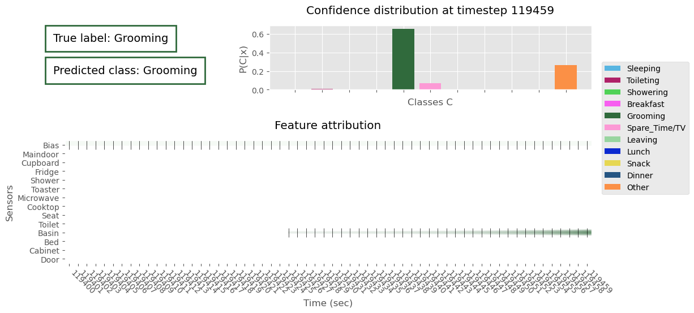

# Temporal Spike Attribution - A local feature-based explanation for temporally coded Spiking Neural Networks

This repository contains the Python 3 code for Temporal Spike Attribution (TSA), a method to extract 
feature attribution explanations for temporally coded Spiking Neural Network. 
TSA is demonstrated on a time-series classification use case with SNN models built as recurrent networks in discrete 
time. [^1]

TSA generates class-wise feature attribution maps that can be overlayed with the spiking data to explain a 
certain prediction of a SNN, based on model internal variables (i.e., spike trains, learned weights). The intensity corresponds
to the attribution value and the color corresponds to the class that the input is attributing to. Additionally, 
the classification confidence is visualised to give context about the model behavior. 

### Required Python packages
* numpy
* pandas
* scikit-learn
* matplotlib
* pytorch
* pickle
* tqdm

### Data
The use case dataset is the activities of daily living (ADL) from binary sensors [^2] dataset which is openly 
available in the [UCI ML Repository](https://archive.ics.uci.edu/ml/datasets/Activities+of+Daily+Living+%28ADLs%29+Recognition+Using+Binary+Sensors).

In the frame of this work, the data has been interpreted as one long time series per subject ranging across all the days
of data collection. For this, the data has been preprocessed and transformed to build one long time series.
The code for this is in the `preprocessing` and folders. A constant bias sensor activation is added. Additionally, the classification task is broken down to each second, 
meaning that the models predict the subject's current activity at each second.

#### Instructions
1. Download the data from the [UCI ML Repository](https://archive.ics.uci.edu/ml/datasets/Activities+of+Daily+Living+%28ADLs%29+Recognition+Using+Binary+Sensors).
2. Store the csv files in `data/raw/UCI ADL Binary Dataset`
3. Run `python preprocessing/adl_data_writing.py` to generate the "long time series" data.

### SNN model building
The SNN models use LIF neurons, temporal coding and were implemented as recurrent networks in discrete time trained 
with a fast sigmoid surrogate gradient as per tutorial of Dr. F. Zenke[^1]. There are some changes to Dr. Zenke's original
code as the membrane potential is retained in between epochs and batches to approximate sequential processing of the time series.
Purely sequential processing requires too much computation time, which is the reason for the approximation. 

To build the models, the data has to be transformed into a *spike time, spike unit* format. 
The dataset was split into non-overlapping windows of 900 seconds for tuning and training. 
For the explanation experiments, the whole time series per subject is maintained. 

Three SNNs with one, two, three layers respectively are tuned and trained on the ADL task, and their predictions are explained by TSA.

The following hyperparameters were tuned based on the NLL loss on the validation set after 20 epochs training: $\Delta t, \tau_{syn}, \tau_{mem}$, learning rate, batch size, hidden layer sizes. 
Then, the models are trained with early stopping and a patience of 20 epochs. The scripts to rerun the tuning and training 
are located in `models`, but the tuned and trained model weights are also available. 

#### Instructions
* Run `python data/data_generation.py` to generate and save the datasets in the *times, units* format. `data/dataset900.pkl` then corresponds to the dataset used for tuning and training, while `data/dataset_max.pkl` will be used for the TSA experiments.
* Run `python models/tuning_onelayersnn.py`, `python models/tuning_twolayersnn.py`, `python models/tuning_threelayersnn.py` to tune the hyperparameters of the different SNN models respectively.
* Alternatively, the chosen hyperparameters can be inspected as `models/best_params_one.pkl, models/best_params_two.pkl, models/best_params_three.pkl` respectively.
* Run `python models/training_onelayersnn.py`, `python models/training_twolayersnn.py`, `python models/training_threelayersnn.py` to train the SNN models.
* Alternatively, the trained weights are available at `models/weights_one_epoch4.pt, models/weights_two_epoch63.pt, models/weights_three_epoch48.pt`.

### Explanation extraction with TSA

TSA builds on SNN model internal variables to build a feature attribution explanation. 
Namely, these are the spiking behavior of the neurons when presented an input, the learned weights and the state variables of the output layer which the model prediction is based on.
In the case of the SNN models presented earlier, this is the output layer membrane potential. 
The explanation is generated by a matrix multiplication approach of these elements per time step of the input, which is concatenated to make up the final explanation. 
The result is a 3 dimensional attribution map, specifying the input's attribution to the output classes at input dimension and time step granularity.

2 variants of TSA are distinguished by the way the attribution of the spike behavior component is interpreted.
The attribution of the input at time *t* depends on the model neuron's Neural Contribution Score (NCS)[^3]. 
If there is a spike at *t*, the contribution is clear. However, if there is no spike, there are two
interpretations in this case, where the input already exhibits a temporal dimension. 

The first interpretation assumes the absence of a spike to mean no contribution of a neuron to its downstream neurons. 
This translates to a NCS of 0, so that only spikes are considered in these explanations. Therefore, this variant is called TSA-S (only spikes). 

The second interpretation assumes the absence of a spike to have an effect on the downstream neurons. 
The effect is the absence of the change that would have occurred if there was a spike at *t*. 
Hence, the NCS is the negative NCS of spikes. This way, there are also non-spikes considered in the explanation. This approach is called TSA-NS (non-spikes).

The provided code enables the extraction of local explanations with either method.
For the experiments, a subset of time stamps are defined to extract explanations for. 
These are saved in `data/quantitative_test_t_A.pkl` and `data/quantitative_test_t_B.pkl` for the data of subjects A and B respectively.

#### Instructions
* Create folders `tsa/tsa-s` and `tsa/tsa-ns`.
* Run `python tsa/explanation_extraction.py` to generate TSA-S, TSA-NS and baseline explanations (random attribution).

### Evaluation of TSA 
TSA's explanatory performance is evaluated in faithfulness (explanation selectivity[^4]), attribution sufficiency, stability (max-sensitivity[^5]
using the Frobenius norm). 

Faithfulness refers to TSA's ability to faithfully represent the model behaviour. 
Attribution sufficiency addresses whether the feature attributions found by TSA identify a sufficient set of features in the input that are sufficient to the model prediction.
Stability refers to the behavior of TSA when presented with similar input. 

The scripts to run this evaluation are provided in the `tsa` folder. 

#### Instructions
* Create folders `faithfulness`, `sufficiency`, `sensitivity` with the subfolders `tsa-s` and `tsa-ns` each.
* Run `python tsa/faithfulness_evaluation.py` (long run-time), `python tsa/sufficiency_evaluation.py`, `python tsa/sensitivity_evaluation.py`. 
* The results will be in the subfolders created before.
* View the results by running the notebook `tsa/quantitative_analysis_results.ipynb`.

[^1]: Per tutorial of Friedemann Zenke (https://github.com/fzenke/spytorch, License: http://creativecommons.org/licenses/by/4.0/)

[^2]: Ordonez, F.J.; de Toledo, P.; Sanchis, A. Activity Recognition Using Hybrid Generative/Discriminative Models on Home Environments Using Binary Sensors. Sensors 2013, 13, 5460-5477.

[^3]: Youngeun Kim and Priyadarshini Panda. Visual explanations from spiking neural networks using inter-spike intervals.Scientific Reports, 11(1), 2021.

[^4]: Grégoire Montavon, W. Samek, and K. Müller. Methods for interpreting and understanding deep neural networks.Digit. Signal Process., 73:1–15, 2018.

[^5]: Chih-Kuan Yeh, Cheng.Yu Hsieh, Arun Suggala, David I Inouye, and Pradeep K Ravikumar. On the (in)fidelity and sensitivity of explanations. In H. Wallach, H. Larochelle,A. Beygelzimer, F. d'Alché-Buc, E. Fox, and R. Garnett, editors,Advances in Neural Information Processing Systems, volume 32. Curran Associates, Inc., 2019.